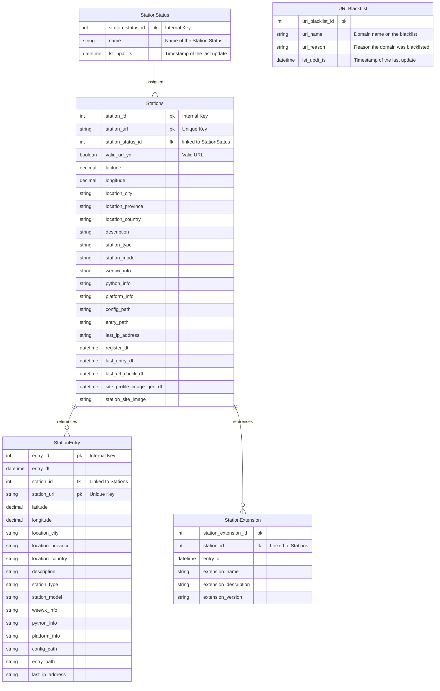
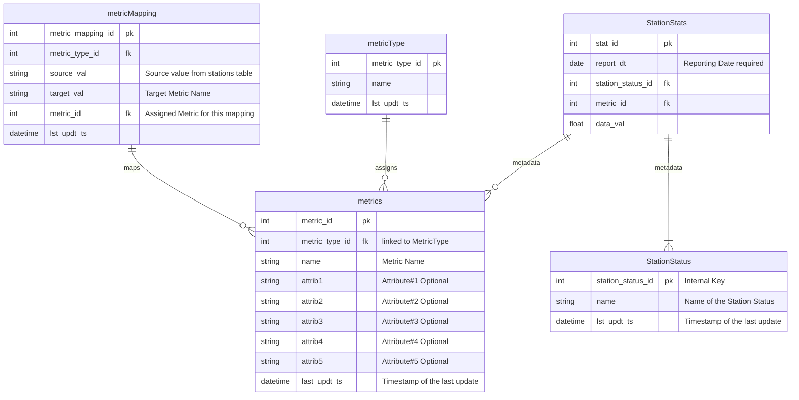
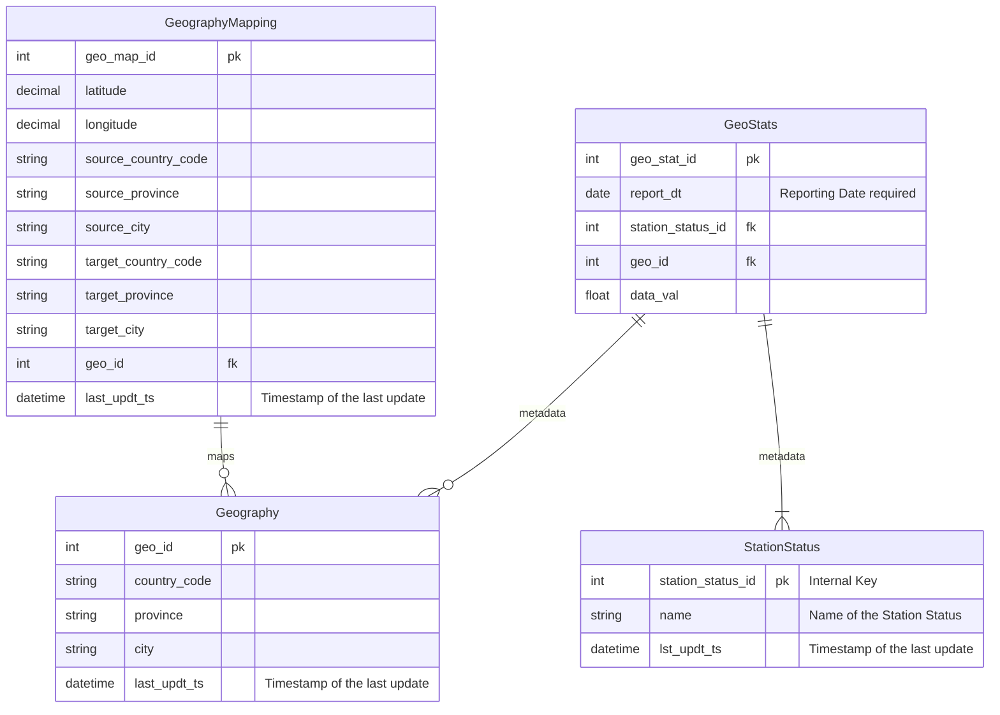

# Data Model Design
Last Updated 12-28-2022

## Station Registry Data Model
NOTE: Tables will be prefixed with stationregistry_

## Station Stats Data Cube (Star Schema Data Model)
NOTE: Tables will be prefixed with regstats_

## Station Geographical Statistics Data Cube (Star Schema Data Model)
NOTE: Tables will be prefixed with regstats_

