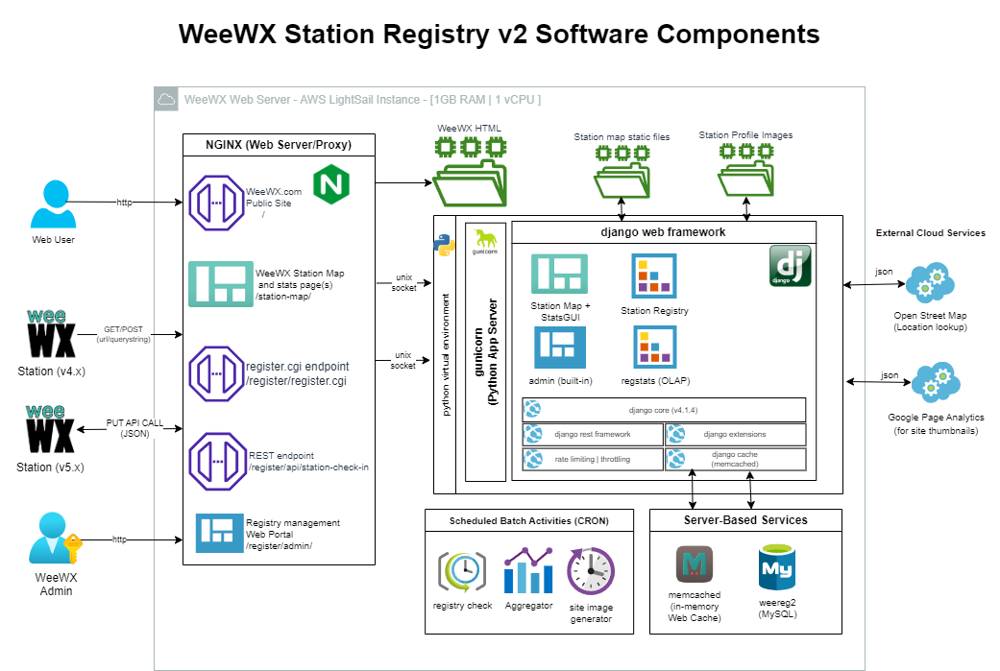

# Station Registry V2 Design

## Software Component Diagram

### NGINX Web Server

* The solution will use the existing NGINX Web Server installed on the AWS LightSail instance
* The NGINX Server will be reconfigured to pass 3 locations for the weewx.com domain:
   * The root (/) of the domain will be routed to the existing location of the weewx website.
   * The /register directory of the domain will be routed to a unix socket. That socket will be used by Guicorn to act as a WSGI gateway for the Station Registry component as well as the Registry Management portal (/register/admin/)
   * the /station-map directory of the domain will be routed to a unix socket. That socket will also be used by gunicorn to broker requests for the station map and stats solution of the site.
* It may be required to host the static assets that the station registry and station map require inside the weewx website. This document will be updated with that fact once the initial integration of weewx.com and the new registery solution is completed in development.

### WeeWX HTML
* The WeeWX HTML solution will need to modified with these changes:
   * removal of /register directory and all files associates
   * removal of /station-map.html
   * Update weewx.js to update the navigation function to point the station map link to the new station map url (/station-map/index.html)

#### WeeWx Station Map and Stats Page
* The station map and stats page will be a dynamic webpage that will serve both a global map from Google showing all the stations as well as statistical graphs with metrics of the data.
* The dynamic solution will be hosted by django through gunicorn's python process server and nginx.
* The charts will use chart.js and will be tied to views within the stationmap app inside the django project (weewx)
* All charts and map objects will query the database for each user.
* The Station maps and stats page will leverage memcached for filter lists and other metadata elements for speed and disk I/O.

#### Register.cgi endpoint
* The register.cgi endpoint will be replicated inside the stationregistry app within the django project (WeeWX)
* It will be properly routed to match the same url endpoint that the existing solution services : http://weewx.com/register/register.cgi
* the endpoint will accept GET and POST requests.
* the solution will check and validate the data elements that are arriving via querystring. Those items are:

    station_url : This is required and the request will be marked failed without a valid unique URL
    
    latitude
    
    longitude
    
    station_type
    
    station_model
    
    weewx_info
    
    python_info
    
    platform_info

#### REST Endpoint
* This will be a new endpoint. It will reside in the stationregistry app within the django project (WeeWX)
* The new endpoint url will be: http://weewx.com/register/station-check-in
* The new endpoint will expect a PUT request with a JSON payload. That payload will consist of the following data elements:

    station_url

    latitude

    longitude

    station_type

    station_model

    weewx_info

    python_info

    platform_info

    config_path

    entry_path

    extensions: This will be a list of json objects consisting of the following:

        extension_name

        extension_description
        
        extension_version

* The end point will execute the following validations on the data:

    station_url_check: Verify it is a valid url and if it is already in the system. If it is already in the system, we will consider this a update and provide the internal station_id to the calling function.

    latitude/longitude check: verify the latitude and longitude values are valid decmial values and within normal geospatical bounds.

    url blacklist check: Verify the url's domain name is not on our blacklist. 

    data santiy checks on the rest of the fields.

* The end point will use the same tables as the existing register.cgi method.

    

#### Registry Management Web Portal

### Django Components

#### Python Virtual Environment

#### Gunicorn Process Server

#### Django Core

#### Django Extensions

#### Django Cache

#### Django Rest Framework

##### Rate limiting + Throttling Configuration

### Station Registry Components

#### Station Maps + GUI

#### Admin

#### StationRegistry

#### regstats (OLAP)

### Schedule Batch Activities

#### Registry Check

#### Aggregator

#### Site Image Generator

### Server-Based Services

#### PyMemCache

#### MySQL

### External Cloud Services

#### Open Street Map

#### Google Page Analytics

